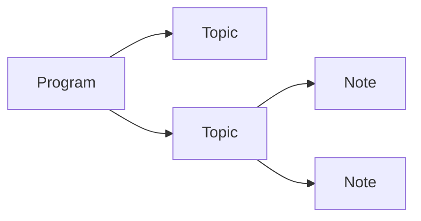

# Essences (Models)
  - Program
  - Topic
  - Note
  - User

# Architecture




# Roles
  - superadmin
  - admin
  - teacher 
  - user (default)


# Permission
## Basis for Owner and Delegated User
- Program, Topic, Note
  - Create
    - superadmin
    - teacher
    - admin
  - Read
    - all
  - Update
    - superadmin
    - teacher
    - admin
  - Delete
    - superadmin
    - teacher
    - admin

- User
  - Create
    - admin
    - superadmin
  - Read
    - admin
    - superadmin
  - Update
    - admin
    - superadmin
  - Delete
    - admin
    - superadmin


### Deligated User
Users who create smth can CRUD it and also can who have permission
for example.  
```ProgramModel: {
  user: id1,
  permissions: [
    id2, id3
  ]
}
```
Notes Delegated User should have necessary role 

### User CRUD User
- superadmin
- admin
  - teacher
  - user

